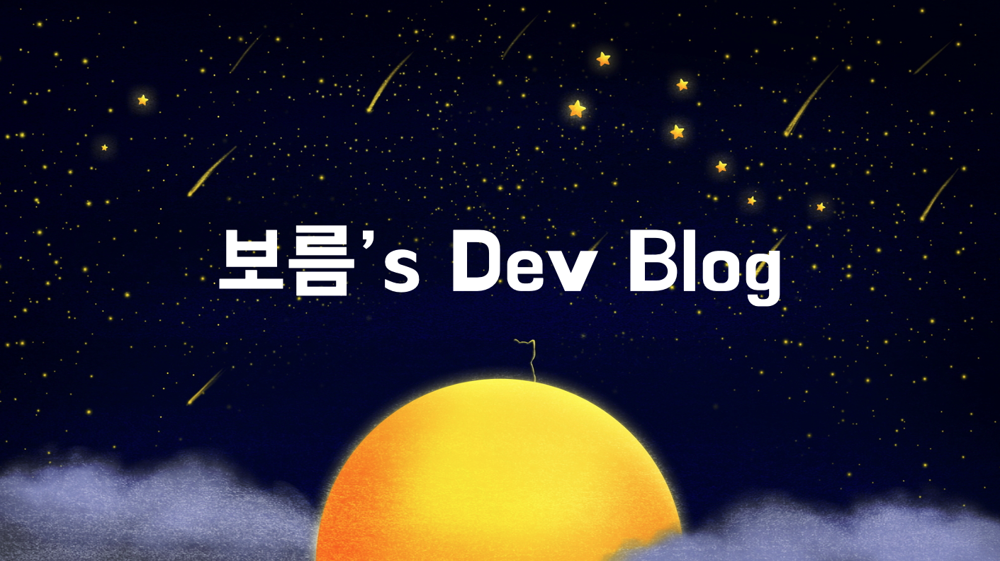

## 🐈‍⬛ GitHub

  
 
  

## 📝 Latest Blog Post

<table style="width: 100%; text-align: center;"><tbody><tr>
<td style="width: 25%;">
    <a href="https://shkisme.vercel.app/2024-03-log">
         
        
2024년 3월 회고   (2024/03/31)

    </a>
    2024년 3월 회고입니다.
</td>
<td style="width: 25%;">
    <a href="https://shkisme.vercel.app/growing-up-together">
         
        
함께 자라기   (2024/03/27)

    </a>
    회사에서 “함께 자라기” 책을 읽고 세미나를 진행했습니다. 책과 세미나에 대한 전반적인 내...
</td>
<td style="width: 25%;">
    <a href="https://shkisme.vercel.app/rest-rpc">
         
        
Rest vs RPC   (2024/03/19)

    </a>
    Rest 통신과 RPC 통신의 차이점을 비교해봤습니다.
</td>
</tr>
<tr>
<td style="width: 25%;">
    <a href="https://shkisme.vercel.app/BDDictionary">
         
        
BDD 세미나 기술 발표 - BDDictionary   (2024/03/05)

    </a>
    BDD 첫 세미나에서 내가 만들어 본 객체 지향 소프트웨어를 주제로 기술 발표를 하였습니다...
</td>
<td style="width: 25%;">
    <a href="https://shkisme.vercel.app/my-first-open-source-contribution">
         
        
첫 오픈소스 기여!   (2024/03/02)

    </a>
    블로그 렌더링 오픈소스 morethan-log에 기여해보았습니다.
</td>
<td style="width: 25%;">
    <a href="https://shkisme.vercel.app/2024-02-log">
         
        
2024년 2월, 그리고 겨울방학 회고   (2024/02/29)

    </a>
    2024년 2월과 겨울방학 회고입니다.
</td>
</tr></tbody></table>